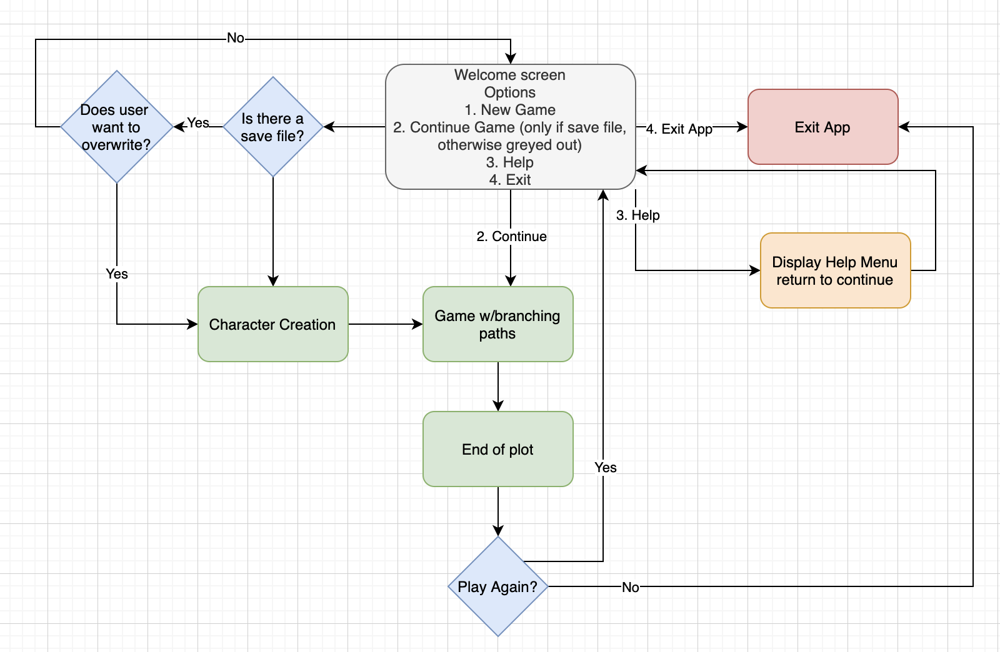
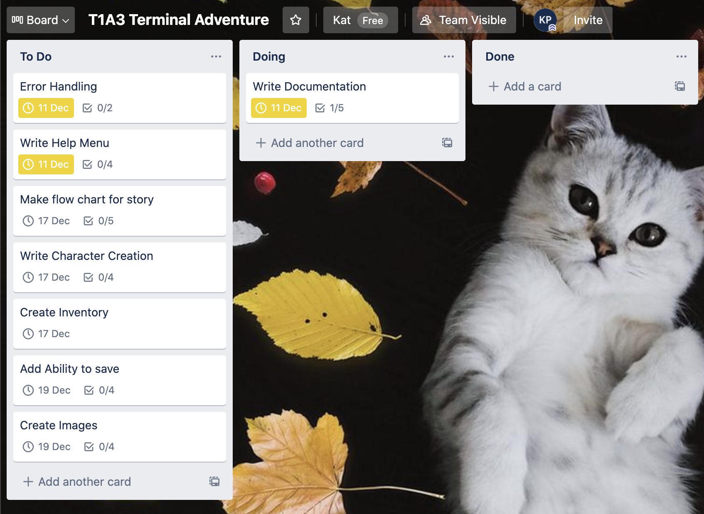

# Terminal Adventure
<!-- To do: Pick a title -->
T1A3

<!-- Develop a statement of purpose and scope for your application. It must include:
- describe at a high level what the application will do
- identify the problem it will solve and explain why you are developing it
- identify the target audience
- explain how a member of the target audience will use it -->

## Statement of Purpose
This application is a text-based adventure in the style of classic games such as Colossal Cave Adventure. It is run within the terminal. The user will be able to create and change their character before they begin, and this will impact how the story plays out.
The application will receive user input and store it in a 'hero' class.  This will then be used through the application. The user will go through the story and do a series of puzzles and tasks in order to 'win' the game.
The target audience is Coder Academy instructors and peers, as well as potential future employers. It will be suitable for all ages

<!-- Develop a list of features that will be included in the application. It must include:
- at least THREE features
- describe each feature
Note: Ensure that your features above allow you to demonstrate your understanding of the following language elements and concepts:
- use of variables and the concept of variable scope
- loops and conditional control structures
- error handling -->
## MVP Features
- A character creator section, and option to skip
- An inventory
- Help menu
- A branching story with at least 3 possible outcomes
- Images
- Error handling

## If time/future Features
- More than 3 outcomes
- More complex art
- Ability to save
<!-- Develop an outline of the user interaction and experience for the application.
Your outline must include:
- how the user will find out how to interact with / use each feature
- how the user will interact with / use each feature
- how errors will be handled by the application and displayed to the user -->

<!-- Develop a diagram which describes the control flow of your application. Your diagram must:
- show the workflow/logic and/or integration of the features in your application for each feature.
- utilise a recognised format or set of conventions for a control flow diagram, such as UML. -->

<!-- Develop an implementation plan which:
- outlines how each feature will be implemented and a checklist of tasks for each feature
- prioritise the implementation of different features, or checklist items within a feature
- provide a deadline, duration or other time indicator for each feature or checklist/checklist-item -->

<!-- Utilise a suitable project management platform to track this implementation plan

> Your checklists for each feature should have at least 5 items. -->
## Project Management
Trello board:
https://trello.com/b/uIEJXZSx/t1a3-terminal-adventure

<!-- Design help documentation which includes a set of instructions which accurately describe how to use and install the application.

You must include:
- steps to install the application
- any dependencies required by the application to operate
- any system/hardware requirements -->

